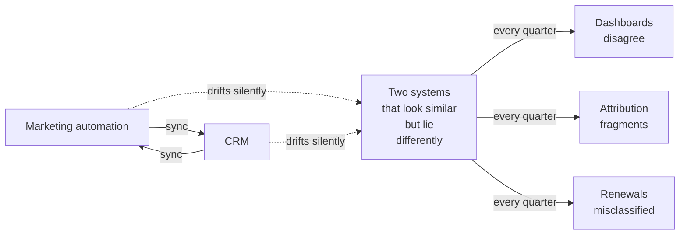
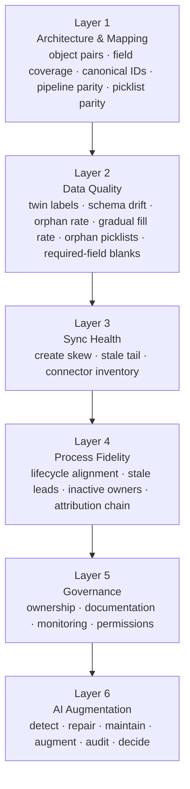
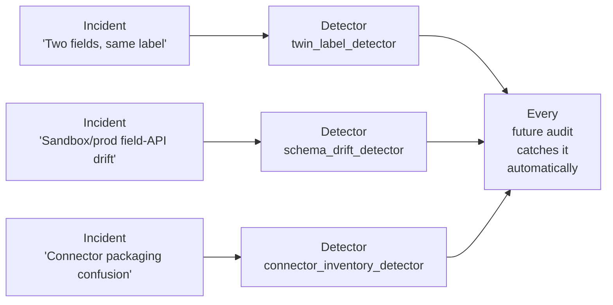
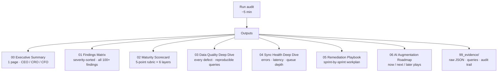
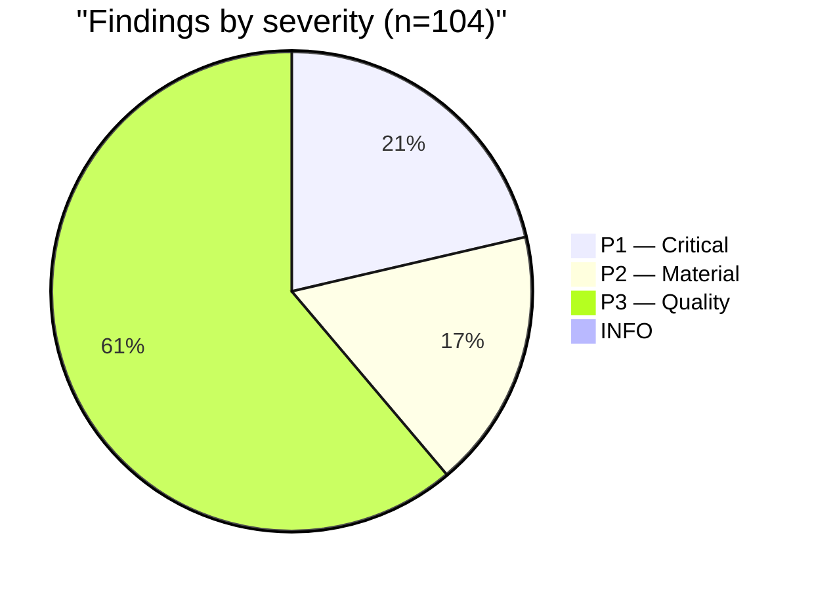
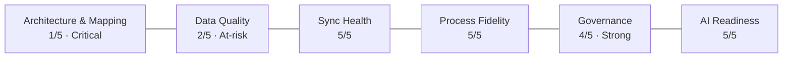
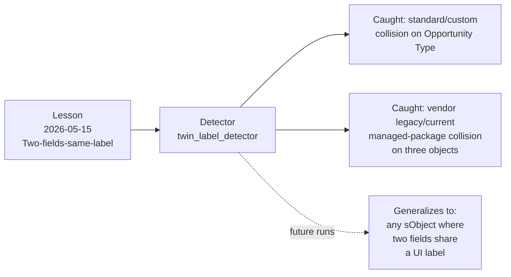
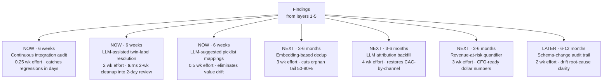

# The Six-Layer Integration Audit

A consulting-grade primitive that produces, in five minutes, the deliverable Big-Four firms charge $150K–$500K and three to six months to assemble: a complete audit of a HubSpot↔Salesforce integration with a maturity scorecard, severity-ranked findings, a remediation playbook, and an AI augmentation roadmap.

> **Built by [Justin Fowler](https://justinfowler.com)** — Director of Revenue Operations, Chicago. Case study from a live engagement against a real B2B SaaS production environment plus its partial sandbox. All customer names and specific record values redacted.

---

## TL;DR

| Headline | Value |
|---|---|
| **Build time** | One working session |
| **Run time on a real environment** | ~5 minutes against production + sandbox + HubSpot portal |
| **Findings produced** | 22 P1, 18 P2, 63 P3 (real defects, post-calibration) |
| **Cost to replicate manually** | $150K–$500K per Big-Four engagement |
| **Code structure** | 4,137 lines of primitive + 6,647 lines of generated deliverable |
| **Reuse model** | One YAML config per customer; same code base for every engagement |

The framework — not the one-time output — is the intellectual property. The repo containing the primitive source remains private; this case study explains what the primitive does, how it works, and what running it produced in a live engagement.

---

## The problem

Every B2B company that has been around more than three years has a HubSpot↔Salesforce integration. Almost none of them know whether it works.

The failure mode isn't "the sync is broken." Broken syncs trigger pager alerts and get fixed in days. The failure mode is **silent drift**:

- Two Salesforce fields share the same UI label. Reps fill both. Reports built on different fields return different numbers. Nobody knows which dashboard is "real."
- A canonical cross-system ID field is *declared* in the integration's settings but doesn't actually exist on the receiving object. Every reconciliation runs against a missing key.
- A custom field's fill rate climbs from 0% in 2019 to 100% in 2026. Any time-series report silently mixes "mostly blank" historicals with "mostly filled" recents.
- The partial sandbox has a field with one API name; production has the same label but a different API name. Sandbox-first validation gives false confidence; the deploy fails in prod.

Each of these has a real incident behind it. The audit primitive encodes the incidents as detectors.



The Big-Four firms sell a six-figure audit to fix this. The audit takes months. By the time it's delivered, the drift has compounded.

---

## The approach

The primitive runs in five minutes against any HubSpot portal + Salesforce org pair. It produces seven deliverables.

### Six audit layers



Each layer scores 1–5 against a maturity rubric. Each finding cites the underlying query so the buyer can reproduce it.

### Lesson-bound detectors

The differentiator. Three of the audit's most consequential detectors exist because real incidents proved they were necessary:



A junior engineer running the audit catches the exact silent-failure shapes a senior engineer learned the hard way. The IP is the lesson-detector mapping, not the Python.

### Seven-file deliverable



Each file is **role-targeted**: exec summary speaks in dollars and severity counts; deep dives speak in SOQL and field names; remediation playbook reads as a sprint plan. Conflating audiences is what makes consulting deliverables get thrown out.

---

## A real engagement (anonymized)

The primitive was built and then immediately run against a live production environment. Customer name redacted; the audit shape, finding distribution, and detector behavior are presented as the case study evidence.

### Engagement scope

| | Value |
|---|---|
| **Industry** | B2B SaaS |
| **Sales motion** | Field (mid-market AE-led) |
| **Estimated ARR** | Single-digit millions |
| **Systems audited** | HubSpot portal + Salesforce production + Salesforce partial sandbox |
| **Connector** | HubSpot's native HubSpot↔Salesforce integration |
| **Audit duration** | ~5 minutes of compute |

### Results



**Overall maturity: 3.67 / 5.0.** The weighted average looks healthy at first glance — but the lowest layer score is the headline number.



The architecture layer is structurally broken; everything above it sits on a shaky foundation. The audit makes that legible in two minutes of reading.

### Top findings, anonymized

The audit produced 104 findings. The headline ones, grouped by class:

| Finding class | Count | Severity | What it represents |
|---|---:|---|---|
| **Zero canonical cross-system ID fields** | 8 | P1 | The integration has no canonical join keys on either side. Reconciliation runs entirely on email matching, which leaves a structural orphan tail. |
| **Twin-label fields on a single object** | 10 | P1 | Multiple cases of two fields sharing the same UI label on Lead / Contact / Account / Opportunity. Reps fill both; reports diverge silently. |
| **Insufficient field mapping coverage** | 4 | P1 | Less than 50% of HubSpot properties have a plausible Salesforce counterpart on some object pairs. Data is trapped in one system. |
| **Sandbox/prod schema drift** | 1 | P2 | A reporting field has different API names across prod and the partial sandbox. Sandbox-first validation is a trap until reconciled. |
| **Gradual fill-rate regime change** | 4 | P2 | Custom Opportunity fields whose fill rate climbs from <10% to >90% across years. Time-series reports lie without raising errors. |
| **Bidirectional picklist divergence** | 11 | P2 | HubSpot and Salesforce picklist option sets disagree in both directions. Records carry values the receiver can't store. |
| **Unilateral picklist surplus** | 59 | P3 | HubSpot ships large default lists (Industry, Country) that the corresponding SF picklist doesn't carry. Usually benign, but worth documenting. |
| **Governance gaps** | 2 | P2/P3 | No declared monitoring URL, no documentation runbook. Errors are discovered reactively. |

The single most consequential finding: **zero cross-system canonical IDs.** The integration believes it has reconciliation keys; it doesn't. Every other defect is downstream of that.

### The detector that generalized

The `twin_label_detector` was built from a single prior incident: a customer-managed `Opportunity Type` field collision between a Salesforce standard field and a custom field. The detector caught that exact collision in the engagement.

It *also* caught a previously-unknown class: a third-party data-enrichment vendor's two Salesforce managed packages (legacy + current generation) both install a field labelled with the vendor's name plus "Last Updated." The detector found the collision on three separate objects without any vendor-specific code.

This is what justifies the lesson-bound-detector architecture: **the encoded lesson generalizes beyond the original incident.**



---

## The AI augmentation roadmap

Layer 6 doesn't detect defects. It consumes the findings from layers 1–5 and produces a prioritized roadmap of AI plays. The roadmap is what makes the audit a retainer pitch rather than a one-time deliverable.



Each play has a tool recommendation, an architecture description, an effort estimate, an impact statement, and a risk list. Plays default to local-first inference (on owned hardware) for data-privacy reasons; cloud is allowlisted to providers with signed DPAs.

The result is: every audit ends with a six-to-twelve month roadmap that the buyer pays you to deliver against. **The audit is the lead; the roadmap is the engagement.**

---

## Why this approach beats the traditional model

| Traditional Big-Four model | This primitive |
|---|---|
| 12-week engagement, $200K–$500K | 5 minutes of compute, then 1 day of consulting time per engagement |
| Deliverable is a slide deck custom-built per customer | Deliverable is seven markdown files, identical structure every time |
| Findings are senior consultants' judgment, undocumented | Findings cite the SOQL / API call that produced them; reproducible by the buyer |
| Drift starts compounding the day after delivery | Designed to be re-run quarterly; scorecard tracks improvement |
| Doesn't include an AI implementation plan | AI augmentation roadmap is layer 6 of the audit |
| One-off engagement | Codified detector library compounds value across customers |

The structural advantage: **every engagement makes the next engagement faster.** Detector calibration tuning, new lesson-bound detectors, customer-segment severity defaults — they all roll back into the primitive. The 50th engagement is materially better than the 5th because the detector library has been hardened against 50 real-world failure modes.

---

## How the primitive is packaged

```
hsfdc-audit/
├── README.md                                  # Entry point
├── audit.example.yaml                         # The customer contract — every config knob lives here
├── lib/
│   ├── findings.py                            # Finding dataclass + severity taxonomy
│   ├── config.py                              # Pydantic model for audit.yaml
│   ├── scoring.py                             # 5-point maturity rubric
│   ├── hubspot_client.py                      # Async HubSpot REST client
│   ├── salesforce_client.py                   # SF client wrapping simple_salesforce + sfdx
│   ├── reconciler.py                          # Cross-system matchers (pure functions)
│   └── render.py                              # Jinja2 deliverable renderer
├── audits/
│   ├── _01_architecture.py                    # Mapping / canonical IDs / picklist / pipeline parity
│   ├── _02_data_quality.py                    # Twin labels / drift / orphans / fill rate
│   ├── _03_sync_health.py                     # Behavioral inference when telemetry is opaque
│   ├── _04_process.py                         # Lifecycle / lead-to-opp / attribution
│   ├── _05_governance.py                      # Ownership / docs / monitoring / permissions
│   └── _06_ai_recommendations.py              # Synthesizes findings into the AI roadmap
├── templates/                                 # Seven Jinja2 templates, one per deliverable
├── scripts/
│   ├── verify_auth.sh                         # Preflight: are creds working?
│   └── run_audit.sh                           # Orchestrator
├── examples/<customer>/                       # Fully worked engagement, generated output committed as proof
└── docs/
    ├── TEMPLATE_GUIDE.md                      # How to take this to a new customer
    └── DETECTOR_REFERENCE.md                  # Every detector + calibration knob
```

The Python is the substrate. The intellectual property is in three places:

1. **`audit.example.yaml`** — the schema for tenant configuration. Every severity threshold, every reconciliation field name, every connector category encodes a judgment call that consultants charge for. Codifying these as config keys lets a junior engineer run the audit while the resulting deliverable still reflects senior-level priorities.
2. **`audits/_NN_*.py`** — the detector library. Each detector is a function from (config + clients) to a list of findings. New silent-failure shape from a new engagement? Add a detector, ship.
3. **`templates/*.j2`** — the audience-targeted report templates. The execs read 00 and 02. The engineers read 03–06. Conflating these is what makes most consulting deliverables feel both too long and too shallow.

---

## Sample deliverable (anonymized)

The full set of seven deliverables produced for the engagement lives in the private repo. Two samples — the executive summary and the maturity scorecard — are reproduced in this repo with all customer-identifying values redacted:

- [`sample/00_executive_summary.md`](sample/00_executive_summary.md) — what the CRO reads first
- [`sample/02_maturity_scorecard.md`](sample/02_maturity_scorecard.md) — what the RevOps lead presents quarterly

---

## Engagement model

The primitive lends itself to three engagement tiers:

| Tier | Scope | What's included |
|---|---|---|
| **Audit** | One-shot run + walkthrough | Seven deliverables · 90-min review with CRO/RevOps lead · prioritized remediation list |
| **Audit + Sprint 1** | Above + P1 fixes | Above · my team executes the highest-severity remediations · re-audit on completion to confirm score improvement |
| **Annual program** | Quarterly audits + AI roadmap delivery | All of the above · quarterly re-runs comparing maturity scorecards · delivery of one or two AI plays per quarter · standing channel for incident response |

Pricing is engagement-dependent; the primitive's economics are structural — variable cost per audit is roughly 1 day of senior engineer time plus modest API quotas. Margin is in the codified judgment, not the labor.

---

## Why this matters for RevOps leaders

Three things make integration audits perpetually under-invested:

1. **The damage is invisible.** No dashboard says "this number is wrong by 14% because of a twin-label field." The audit makes the damage legible.
2. **The remediation is owned by nobody.** Marketing assumes RevOps owns it; RevOps assumes IT owns it; IT assumes the connector vendor owns it. The audit's governance layer surfaces the ownership gap explicitly.
3. **The Big-Four cost is prohibitive for most mid-market companies.** A $300K audit only happens at companies > $50M ARR. Everyone else just lives with the drift. This primitive collapses the cost by two orders of magnitude.

The combined result: a mid-market B2B can now run, every quarter, the audit that used to be reserved for enterprises. The continuous-audit AI play makes it weekly. Drift goes from "we'll discover this in a year" to "we'll see it on Monday."

---

## About

Built by **[Justin Fowler](https://justinfowler.com)** — Director of Revenue Operations at a B2B SaaS scale-up, based in Chicago. MBA, ten years in revenue operations across field-sales and partner-led motions, deep experience hand-building HubSpot↔Salesforce integrations and then breaking them.

The primitive emerged from a single observation: every silent-failure incident in my own lessons file deserved to be a detector, not a one-time fix. The compounding value of that observation is what makes this a *primitive* rather than a *tool*.

The primitive's source code is private. The case study, the methodology, and the engagement model are open — if you run RevOps and want this audit on your own systems, [reach out](https://justinfowler.com).

---

## License

This case study (README, sample deliverables, and diagrams) is licensed [CC BY-NC-SA 4.0](LICENSE). The primitive's source remains private.
