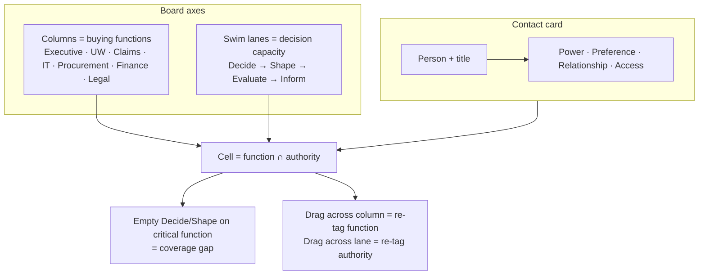
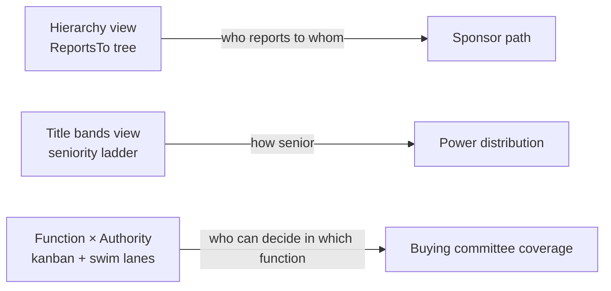

# Concept diagram — Function × Authority board



## Compared to existing Org Chart (CRM) views



## Suggested Salesforce view switcher

```text
Account → Org Chart (CRM)
  [ Hierarchy ]  [ Title bands ]  [ Function × Authority ]
```
